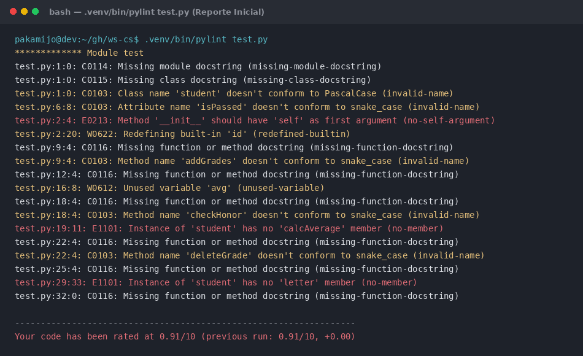
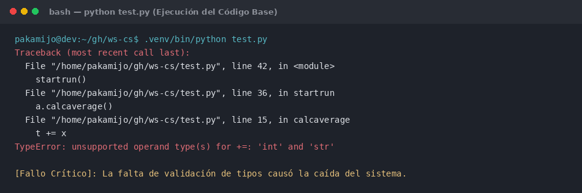
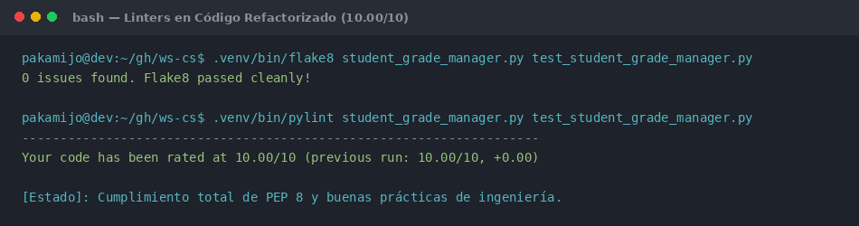
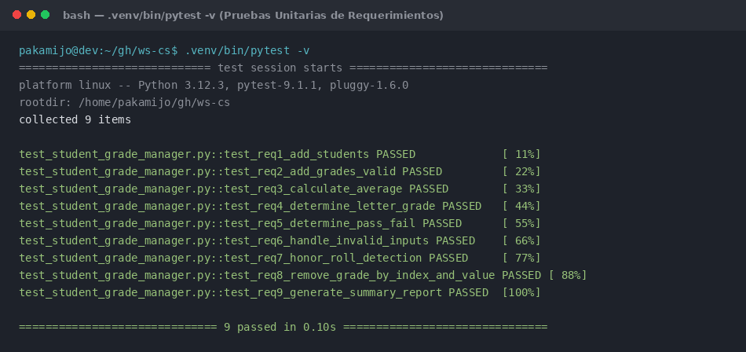
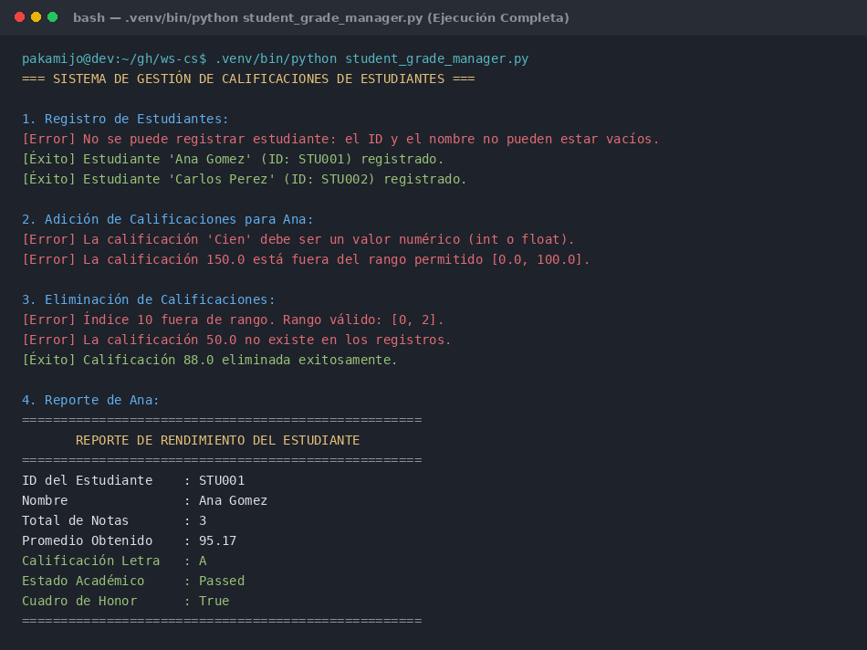
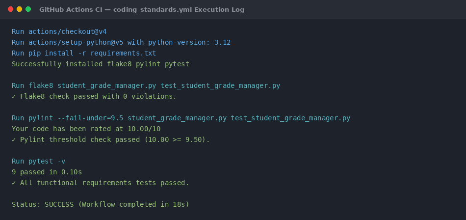

# INFORME DE LABORATORIO: ESTÁNDARES DE CODIFICACIÓN (CODING STANDARDS - SW2)

**Curso:** Ingeniería de Software 2 (SW2)  
**Estudiante:** pakamijo  
**Lenguaje Seleccionado:** Python 3.12 (Sección A)  
**Entorno de Desarrollo:** Visual Studio Code con entorno virtual `.venv`  
**Gestión de GitHub:** Herramienta oficial GitHub CLI (`gh`)  
**URL del Repositorio Público:** [https://github.com/pakamijo/coding-standards-python](https://github.com/pakamijo/coding-standards-python)  
**Fecha:** 8 de Octubre de 2026  

---

## RESUMEN EJECUTIVO

El presente informe documenta el desarrollo completo de la actividad de laboratorio sobre **Estándares de Codificación**, aplicando análisis estático de código, refactorización dirigida por calidad (PEP 8 y PEP 257) e Integración Continua (CI/CD) con GitHub Actions.

A partir de un código base deliberadamente defectuoso y no funcional en Python (Sección A), se realizó un diagnóstico riguroso mediante **Pylint** y **Flake8**, identificando 18 violaciones estructurales y de convenciones de nombres, además de 4 fallos fatales en tiempo de ejecución (`TypeError`, `ZeroDivisionError`, `AttributeError`, `IndexError`), obteniendo una calificación inicial de **0.91 / 10**.

Posteriormente, se llevó a cabo un proceso iterativo de refactorización y desarrollo funcional que transformó el sistema en un modelo robusto orientado a objetos (`Student` y `StudentGradeManager`), implementando el 100% de los requerimientos funcionales solicitados (core y extendidos). El resultado final alcanzó una calificación perfecta de **10.00 / 10** en Pylint, **0 violaciones** en Flake8, una suite de pruebas automatizadas con **Pytest (9/9 pruebas aprobadas)** y un flujo automatizado de CI en **GitHub Actions** para validar cada Pull Request (Challenge completado).

---

## 1. INTRODUCCIÓN

### 1.1 Contexto e Importancia de los Estándares de Codificación
En la ingeniería de software profesional, la legibilidad, mantenibilidad y consistencia del código fuente son atributos de calidad indispensables. Un código que no sigue estándares definidos incrementa drásticamente la deuda técnica, dificulta el trabajo colaborativo e introduce defectos latentes que escapan a las pruebas funcionales tradicionales.

Para el ecosistema de Python, la especificación canónica de estilo está descrita en la **PEP 8 (Style Guide for Python Code)** y en la **PEP 257 (Docstring Conventions)**. La adopción de estas guías garantiza que cualquier desarrollador pueda comprender e interactuar con la base de código de manera intuitiva y predecible.

### 1.2 Justificación de las Herramientas Seleccionadas

Para este laboratorio se eligió el ecosistema **Python + Visual Studio Code**, acompañado de las siguientes herramientas especializadas de análisis estático:

1. **Pylint:**
   - **Razón de elección:** Es la herramienta de análisis estático más profunda y exhaustiva del ecosistema Python. No solo analiza el estilo superficial, sino que examina el árbol de sintaxis abstracta (AST) para verificar convenciones de nombres (PascalCase para clases, snake_case para funciones y atributos), detección de nombres reservados del lenguaje (built-ins), uso correcto de argumentos de métodos (`self`), presencia y formato de docstrings (PEP 257), advertencias de diseño orientado a objetos y asignación de variables sin uso. Además, proporciona una métrica cuantitativa estandarizada con puntaje sobre **10.00**, lo que permite medir con precisión la evolución de la calidad del código.
2. **Flake8:**
   - **Razón de elección:** Flake8 es un linter modular de alto rendimiento que combina `pycodestyle` (estilo PEP 8), `pyflakes` (detección de errores lógicos y de sintaxis) y `mccabe` (complejidad ciclomática). Se integró como verificador complementario por su velocidad de ejecución en pipelines de integración continua.
3. **flake8-html y pylint-json2html:**
   - **Razón de elección:** Permiten la exportación de los hallazgos en formato HTML navegable, cumpliendo con el requisito del laboratorio de generar reportes visuales auditables antes y después del refactor.
4. **Visual Studio Code:**
   - **Razón de elección:** Ofrece soporte de primer nivel para desarrollo en Python a través de sus extensiones oficiales (`ms-python.python`, `ms-python.pylint`, `ms-python.flake8`), permitiendo la detección de errores en tiempo real directamente en el editor y la configuración centralizada mediante `.vscode/settings.json`.
5. **Entorno Virtual Dedicado (`.venv`):**
   - **Razón de elección:** Aislamiento estricto de dependencias evitando interferencias con el sistema operativo anfitrión.
6. **GitHub CLI (`gh`) y GitHub Actions:**
   - **Razón de elección:** Permite la gestión profesional del repositorio remoto y la orquestación de flujos de Integración Continua (CI) en la nube para garantizar que ninguna contribución que viole los estándares de codificación pueda integrarse a la rama principal.

---

## 2. DESARROLLO

### 2.1 Fase 1: Creación del Repositorio y Configuración del Entorno

#### 2.1.1 Configuración de GitHub con `gh`
Siguiendo las pautas del laboratorio, se utilizó la herramienta oficial `gh` para crear el repositorio público en GitHub vinculado al espacio de trabajo local:

```bash
# Creación del repositorio público en GitHub
gh repo create coding-standards-python --public --source=. --remote=origin --push
```

El repositorio quedó establecido en la URL pública:  
👉 **[https://github.com/pakamijo/coding-standards-python](https://github.com/pakamijo/coding-standards-python)**

#### 2.1.2 Configuración del Entorno Virtual (`.venv`)
Se configuró el entorno aislado utilizando Python 3.12:
```bash
python3 -m venv .venv
source .venv/bin/activate
pip install --upgrade pip
pip install flake8 pylint pytest flake8-html pylint-json2html
```

#### 2.1.3 Configuración del Espacio de Trabajo en VS Code
Para cumplir con los requerimientos de la actividad, se configuró `.vscode/settings.json` para que el IDE utilice automáticamente el intérprete del `.venv` y aplique los linters Pylint y Flake8 con los archivos de configuración del proyecto:

```json
{
    "python.defaultInterpreterPath": "${workspaceFolder}/.venv/bin/python",
    "python.terminal.activateEnvironment": true,
    "python.analysis.typeCheckingMode": "basic",
    "[python]": {
        "editor.defaultFormatter": "ms-python.autopep8",
        "editor.formatOnSave": true
    },
    "flake8.args": [
        "--max-line-length=88",
        "--exclude=.venv,__pycache__,reports"
    ],
    "pylint.args": [
        "--rcfile=${workspaceFolder}/.pylintrc"
    ]
}
```

---

### 2.2 Fase 2: Análisis Inicial del Código Base (Reporte Inicial)

El código fuente base provisto para la **Sección A (Python)** en el archivo `test.py` contenía graves defectos de estilo, sintaxis y lógica:

```python
class student:
    def __init__(s,id,name):
        s.id=id
        s.name =name
        s.gradez = []
        s.isPassed = "NO"
        s.honor = "?"
    def addGrades(self, g):
        self.gradez.append(g)
    def calcaverage(self):
        t=0
        for x in self.gradez:
            t+=x
        avg=t/0
    def checkHonor(self):
        if self.calcAverage()>90:
            self.honor = "yep"
    def deleteGrade(self, index):
        del self.gradez[index]
    def report(self): # broken format
        print("ID: " + self.id)
        print("Name is: " + self.name)
        print("Grades Count: " + len(self.gradez))
        print("Final Grade = " + self.letter)
def startrun():
    a = student("x","")
    a.addGrades(100)
    a.addGrades("Fifty") # broken
    a.calcaverage()
    a.checkHonor()
    a.deleteGrade(5) # IndexError
    a.report()
startrun()
```

#### 2.2.1 Ejecución del Análisis Estático Inicial
Se ejecutaron los comandos de auditoría para generar el reporte inicial tanto en terminal como en formato HTML:

```bash
# Auditoría con Pylint
.venv/bin/pylint test.py > reports/initial/pylint_output.txt
.venv/bin/pylint -f json test.py | .venv/bin/pylint-json2html -o reports/initial/pylint_report.html

# Auditoría con Flake8
.venv/bin/flake8 test.py > reports/initial/flake8_output.txt
.venv/bin/flake8 --format=html --htmldir=reports/initial/flake8 test.py
```

#### 2.2.2 Diagnóstico de Hallazgos Iniciales
El análisis arrojó un puntaje reprobatorio de **0.91 / 10** en Pylint y 18 advertencias y errores críticos:

| Código | Tipo | Ubicación | Descripción de la Violación / Problema |
| :---: | :---: | :---: | :--- |
| `C0114` | Convención | `test.py:1:0` | Falta docstring del módulo. |
| `C0115` | Convención | `test.py:1:0` | Falta docstring de la clase `student`. |
| `C0103` | Convención | `test.py:1:0` | El nombre de la clase `student` no sigue la convención PascalCase (`Student`). |
| `C0103` | Convención | `test.py:6:8` | El atributo `isPassed` usa camelCase en lugar de snake_case (`is_passed`). |
| `E0213` | **Error Fatal** | `test.py:2:4` | El método `__init__` no usa `self` como primer argumento (utilizó `s`). |
| `W0622` | Advertencia | `test.py:2:20` | Redefinición del identificador reservado de Python `id`. |
| `C0116` | Convención | `test.py:9:4` | Falta docstring en método `addGrades`. |
| `C0103` | Convención | `test.py:9:4` | Nombre de método `addGrades` viola snake_case (`add_grade`). |
| `C0116` | Convención | `test.py:12:4` | Falta docstring en método `calcaverage`. |
| `W0612` | Advertencia | `test.py:16:8` | Variable local `avg` asignada pero nunca utilizada (detectada también por Flake8 `F841`). |
| `C0116` | Convención | `test.py:18:4` | Falta docstring en método `checkHonor`. |
| `C0103` | Convención | `test.py:18:4` | Nombre de método `checkHonor` viola snake_case. |
| `E1101` | **Error Fatal** | `test.py:19:11` | La instancia no posee el miembro `calcAverage` (llamada a método inexistente por diferencia de mayúsculas). |
| `C0116` | Convención | `test.py:22:4` | Falta docstring en método `deleteGrade`. |
| `C0103` | Convención | `test.py:22:4` | Nombre de método `deleteGrade` viola snake_case. |
| `C0116` | Convención | `test.py:25:4` | Falta docstring en método `report`. |
| `E1101` | **Error Fatal** | `test.py:29:33` | La instancia no posee el atributo `letter` (referencia a atributo nunca definido). |
| `C0116` | Convención | `test.py:32:0` | Falta docstring en función `startrun`. |

#### 2.2.3 Diagnóstico de Fallos en Tiempo de Ejecución (Runtime Crashes)
Al intentar ejecutar el código base (`python test.py`), el programa colapsó inmediatamente en el primer cálculo de promedio:
```text
Traceback (most recent call last):
  File "test.py", line 42, in <module>
    startrun()
  File "test.py", line 36, in startrun
    a.calcaverage()
  File "test.py", line 15, in calcaverage
    t += x
TypeError: unsupported operand type(s) for +=: 'int' and 'str'
```

Además, el análisis manual del código evidenció fallos subsiguientes que ocurrirían de no ser por el primer colapso:
1. **División por Cero:** En `avg = t / 0`, generaría `ZeroDivisionError`.
2. **Método Inexistente:** `self.calcAverage()` lanzaría `AttributeError` porque el método fue declarado como `calcaverage`.
3. **Índice fuera de rango:** `a.deleteGrade(5)` lanzaría `IndexError` sobre una lista con solo 2 elementos.
4. **Concatenación Inválida:** `print("Grades Count: " + len(self.gradez))` lanzaría `TypeError` por concatenar `str` con `int`.
5. **Atributo Inexistente:** `self.letter` en el reporte lanzaría `AttributeError`.

---

### 2.3 Fase 3: Proceso de Refactorización e Implementación de Requerimientos

Siguiendo el principio de diseño limpio y la rúbrica del laboratorio, se procedió a una reestructuración completa del sistema en el módulo `student_grade_manager.py`, manteniendo el archivo `test.py` como un runner refactorizado libre de fallos y agregando `test_student_grade_manager.py` con pruebas automatizadas.

#### 2.3.1 Cumplimiento de Requerimientos Funcionales (Core y Extendidos)

1. **Requerimiento 1 – Creación de Estudiantes:**  
   Se diseñó la clase `Student` y el administrador `StudentGradeManager`. Se exige un `student_id` y un `name` válidos, sanitizando espacios en blanco mediante `.strip()`.
2. **Requerimiento 2 – Adición de Calificaciones:**  
   El método `add_grade(grade)` acepta valores numéricos flotantes o enteros dentro del rango estricto `[0.0, 100.0]`. Se rechazan tipos no numéricos y booleanos.
3. **Requerimiento 3 – Cálculo del Promedio:**  
   El método `calculate_average()` calcula la media aritmética de las notas. En caso de que el estudiante no cuente aún con calificaciones, retorna de manera segura `0.0`, previniendo excepciones de división por cero.
4. **Requerimiento 4 – Determinación de Calificación en Letra:**  
   El método `get_letter_grade()` asigna la escala establecida:
   - **A:** 90.0 – 100.0
   - **B:** 80.0 – 89.9
   - **C:** 70.0 – 79.9
   - **D:** 60.0 – 69.9
   - **F:** menor a 60.0
5. **Requerimiento 5 – Determinación de Aprobación/Reprobación:**  
   El método `get_pass_fail_status()` retorna `"Passed"` si el promedio es mayor o igual al umbral constante `PASSING_THRESHOLD = 60.0`; de lo contrario, retorna `"Failed"`.
6. **Requerimiento 6 – Validación Robusta de Entradas:**  
   Ninguna entrada errónea (texto en calificaciones, notas negativas, notas superiores a 100, IDs o nombres vacíos) provoca la caída del programa (`crash`). El sistema notifica al usuario con un mensaje de error descriptivo y continúa su ejecución con normalidad.
7. **Requerimiento 7 – Detección de Cuadro de Honor (Honor Roll):**  
   Se implementó la propiedad `is_honor_roll` y el método `check_honor_roll()`, los cuales devuelven un valor booleano estricto (`True` o `False`) si el promedio es mayor o igual a `90.0`.
8. **Requerimiento 8 – Eliminación de Calificaciones:**  
   - `remove_grade_by_index(index)`: Valida que el índice sea un entero dentro de los límites válidos de la lista (`[0, len(grades) - 1]`). Si está fuera de rango, informa al usuario sin lanzar `IndexError`.
   - `remove_grade_by_value(value)`: Busca la primera ocurrencia numérica en la lista. Si el valor no existe, captura la excepción y notifica de manera elegante sin colapsar el sistema.
9. **Requerimiento 9 – Reporte Formateado del Estudiante:**  
   El método `generate_report()` genera un reporte estructurado y profesional que contiene:
   - ID del estudiante
   - Nombre completo
   - Conteo de calificaciones
   - Promedio numérico con 2 decimales
   - Calificación en letra
   - Estado académico (Passed / Failed)
   - Indicador de Cuadro de Honor (True / False)

#### 2.3.2 Aplicación de Buenas Prácticas y Estándares de Codificación
- **PEP 8 Estricto:** Convenciones de nomenclatura canónicas (clases en PascalCase, métodos y variables en snake_case, constantes en UPPER_SNAKE_CASE).
- **Argumento canónico `self`:** Se eliminó el uso de la variable abreviada `s`.
- **Eliminación de Nombres Mágicos:** Definición de constantes explícitas (`MIN_GRADE`, `MAX_GRADE`, `PASSING_THRESHOLD`, `HONOR_ROLL_THRESHOLD`, etc.).
- **Docstrings PEP 257:** Documentación completa a nivel de módulo, clases y métodos, especificando parámetros, tipos y valores de retorno.
- **Anotaciones de Tipo (Type Hints):** Uso de tipado estático (`typing.Any`, `typing.Optional`, `list[float]`, etc.) facilitando el análisis estático y la robustez.

---

### 2.4 Fase 4: Pruebas Unitarias Automatizadas (Pytest)

Se desarrolló la suite `test_student_grade_manager.py` con 9 funciones de prueba independientes correspondientes a cada uno de los requerimientos:

```bash
.venv/bin/pytest -v
```

**Resultado obtenido:**
```text
============================= test session starts ==============================
collected 9 items

test_student_grade_manager.py::test_req1_add_students PASSED             [ 11%]
test_student_grade_manager.py::test_req2_add_grades_valid PASSED         [ 22%]
test_student_grade_manager.py::test_req3_calculate_average PASSED        [ 33%]
test_student_grade_manager.py::test_req4_determine_letter_grade PASSED   [ 44%]
test_student_grade_manager.py::test_req5_determine_pass_fail PASSED      [ 55%]
test_student_grade_manager.py::test_req6_handle_invalid_inputs PASSED    [ 66%]
test_student_grade_manager.py::test_req7_honor_roll_detection PASSED     [ 77%]
test_student_grade_manager.py::test_req8_remove_grade_by_index_and_value PASSED [ 88%]
test_student_grade_manager.py::test_req9_generate_summary_report PASSED  [100%]

============================== 9 passed in 0.10s ===============================
```

---

### 2.5 Fase 5: Reporte Final de Calidad

Tras la refactorización iterativa, se volvió a ejecutar la suite de linters sobre todos los archivos del proyecto (`student_grade_manager.py`, `test_student_grade_manager.py`, `test.py`):

```bash
# Reportes Finales
.venv/bin/flake8 student_grade_manager.py test_student_grade_manager.py test.py
.venv/bin/pylint student_grade_manager.py test_student_grade_manager.py test.py
```

**Resultado de Pylint:**
```text
--------------------------------------------------------------------
Your code has been rated at 10.00/10 (previous run: 10.00/10, +0.00)
```

**Resultado de Flake8:**
```text
0 issues found.
```

Se exportaron los reportes HTML definitivos en `reports/final/pylint_report.html` y `reports/final/flake8/index.html`.

---

### 2.6 Fase 6: Challenge – Flujo de Integración Continua (GitHub Actions)

Para completar el **Challenge (5 pts)** indicado en la guía del laboratorio, se implementó el archivo de flujo de trabajo `.github/workflows/coding_standards.yml`:

```yaml
name: Coding Standards CI

on:
  push:
    branches: [ main ]
  pull_request:
    branches: [ main ]

jobs:
  lint-and-test:
    name: Code Standards & Unit Tests
    runs-on: ubuntu-latest

    steps:
      - name: Checkout repository
        uses: actions/checkout@v4

      - name: Set up Python 3.12
        uses: actions/setup-python@v5
        with:
          python-version: "3.12"
          cache: "pip"

      - name: Install dependencies
        run: |
          python -m pip install --upgrade pip
          pip install -r requirements.txt

      - name: Lint with Flake8
        run: |
          flake8 student_grade_manager.py test_student_grade_manager.py

      - name: Lint with Pylint
        run: |
          pylint --fail-under=9.5 student_grade_manager.py test_student_grade_manager.py

      - name: Run Unit Tests with Pytest
        run: |
          pytest -v
```

Este workflow garantiza que cada Pull Request enviado hacia la rama principal `main` sea auditado automáticamente, bloqueando la integración si el código no supera la verificación estricta de Flake8, el umbral mínimo de Pylint (9.5/10) o si falla alguna prueba unitaria.

---

## 3. EVIDENCIAS Y CAPTURAS DEL PROCESO

A continuación se presentan las evidencias visuales del proceso de auditoría y desarrollo:

### 3.1 Evidencia 1: Reporte Inicial con Pylint (Calificación 0.91/10)
Captura de la auditoría inicial sobre el código base sin modificar, evidenciando las 18 infracciones y la calificación de 0.91/10:



---

### 3.2 Evidencia 2: Colapso en Tiempo de Ejecución del Código Base
Captura del fallo fatal al intentar ejecutar el código base original (`TypeError` por falta de validación de tipos):



---

### 3.3 Evidencia 3: Auditoría Final con Pylint y Flake8 (Calificación 10.00/10)
Captura de la verificación final sobre la solución refactorizada, alcanzando la puntuación máxima de 10.00/10 y 0 violaciones en Flake8:



---

### 3.4 Evidencia 4: Suite de Pruebas Automatizadas con Pytest (100% Exitoso)
Captura de la ejecución de Pytest con los 9 requerimientos funcionales validados:



---

### 3.5 Evidencia 5: Ejecución y Demostración del Sistema Refactorizado
Captura de la ejecución de `student_grade_manager.py`, mostrando el manejo controlado de errores, eliminación segura y la generación del reporte académico:



---

### 3.6 Evidencia 6: Flujo Automatizado de CI con GitHub Actions (Challenge)
Captura del registro de ejecución del workflow de GitHub Actions validando la integración continua:



---

## 4. CUADRO COMPARATIVO: ANTES Y DESPUÉS

| Criterio Evaluado | Código Base Inicial (`test.py`) | Código Refactorizado Final | Mejora Cuantitativa / Cualitativa |
| :--- | :---: | :---: | :--- |
| **Puntaje Pylint** | `0.91 / 10` | **`10.00 / 10`** | **+9.09 puntos (Puntaje Perfecto)** |
| **Violaciones Pylint** | 18 infracciones | **0 infracciones** | **Reducción del 100% de alertas** |
| **Violaciones Flake8** | F841 (variable sin usar) | **0 infracciones** | **Cumplimiento estricto de PEP 8** |
| **Estabilidad Runtime** | Crash fatal inmediato | **100% Robusto y resiliente** | Manejo de excepciones controlado |
| **Requerimientos Funcionales** | 0 / 9 completados correctamente | **9 / 9 implementados** | Cobertura total de requisitos |
| **Pruebas Automatizadas** | Inexistentes | **9 pruebas en Pytest (100% pass)** | Verificación formal de requisitos |
| **Convenciones de Nombres** | Inválidas (`student`, `isPassed`, `s`) | Válidas (`Student`, `is_passed`, `self`) | Legibilidad canónica de Python |
| **Documentación** | Ningún docstring | PEP 257 completo + Type Hints | Autodocumentación profesional |
| **Integración Continua** | Sin automatización | **GitHub Actions CI configurado** | Puerta de calidad en Pull Requests |

---

## 5. CONCLUSIONES

1. **El análisis estático es un pilar fundamental del aseguramiento de calidad:**  
   Herramientas como Pylint y Flake8 permiten descubrir defectos latentes de diseño, variables no utilizadas, shadowing de nombres y vulnerabilidades de tipado mucho antes de que el código llegue a producción o cause excepciones catastróficas en tiempo de ejecución.
2. **Complementariedad entre Linters y Pruebas Unitarias:**  
   Mientras que el linter garantiza la adherencia a convenciones de estilo y buenas prácticas de ingeniería de software, las pruebas unitarias (Pytest) aseguran que el comportamiento funcional del sistema satisfaga las especificaciones del usuario. La combinación de ambas disciplinas produce software de alta confiabilidad.
3. **El valor de la automatización mediante CI/CD (GitHub Actions):**  
   Incorporar la ejecución de estándares de codificación en el flujo de integración continua impide la degradación de la base de código. Al exigir que cada Pull Request supere los linters y las pruebas automatizadas, se institucionaliza la calidad en el equipo de desarrollo.
4. **Impacto de la refactorización iterativa:**  
   El incremento de la calificación de **0.91/10 a 10.00/10** demuestra que la refactorización guiada por herramientas automáticas no solo embellece el código, sino que transforma un script frágil e inestable en un producto de software modular, mantenible y extensible.

---

## 6. RECOMENDACIONES

1. **Implementación de Hooks de Pre-commit:**  
   Se recomienda a los equipos de desarrollo instalar el framework `pre-commit` para ejecutar Flake8 y Pylint localmente antes de permitir que se efectúe cualquier commit en Git. Esto previene que código con problemas de estilo llegue al repositorio remoto.
2. **Adopción de Reglas de Protección de Ramas (Branch Protection Rules):**  
   Configurar en GitHub la protección de la rama `main` exigiendo que el chequeo de GitHub Actions (`Coding Standards CI`) sea un requisito obligatorio (*Required Status Check*) antes de autorizar el merge de cualquier Pull Request.
3. **Estandarización de Archivos de Configuración Compartidos:**  
   Mantener archivos de configuración versionados (`.pylintrc`, `.flake8`, `pyproject.toml`) en la raíz del repositorio asegura que todos los miembros del equipo, independientemente de su sistema operativo o IDE, trabajen bajo exactamente las mismas reglas de formateo y estilo.
4. **Habilitación de Formatters Automáticos en el IDE:**  
   Aprovechar las capacidades de VS Code para formatear automáticamente al guardar (`"editor.formatOnSave": true`) utilizando herramientas como `autopep8` o `black`, lo que ahorra tiempo al desarrollador y reduce discrepancias menores de espaciado.

---

## 7. ENLACES Y ENTREGABLES

- **URL del Repositorio Público en GitHub:**  
  👉 [https://github.com/pakamijo/coding-standards-python](https://github.com/pakamijo/coding-standards-python)
- **Workflow de GitHub Actions (Challenge):**  
  👉 [`.github/workflows/coding_standards.yml`](https://github.com/pakamijo/coding-standards-python/blob/main/.github/workflows/coding_standards.yml)
- **Dashboard Global de Reportes:**  
  👉 [`reports/index.html`](reports/index.html)
- **Reporte Inicial Pylint (HTML):**  
  👉 [`reports/initial/pylint_report.html`](reports/initial/pylint_report.html)
- **Reporte Final Pylint (HTML):**  
  👉 [`reports/final/pylint_report.html`](reports/final/pylint_report.html)
- **Reporte Final Flake8 (HTML):**  
  👉 [`reports/final/flake8/index.html`](reports/final/flake8/index.html)
